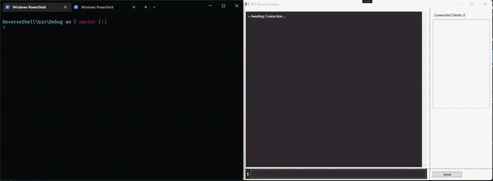

.# Reverse shell
A basic reverse shell for Windows in .NET with a simple WPF UI.

The projects includes the __ReverseShell__ client and the __ReverseShellServer__.

The Server supports multiple connecting clients and allows executing CMD commands to any of them.

## Demo

### Disclaimer
_The projects was created for educational purposes only._
